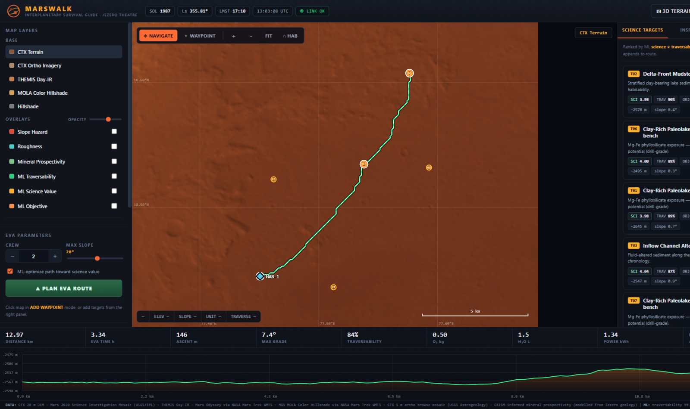
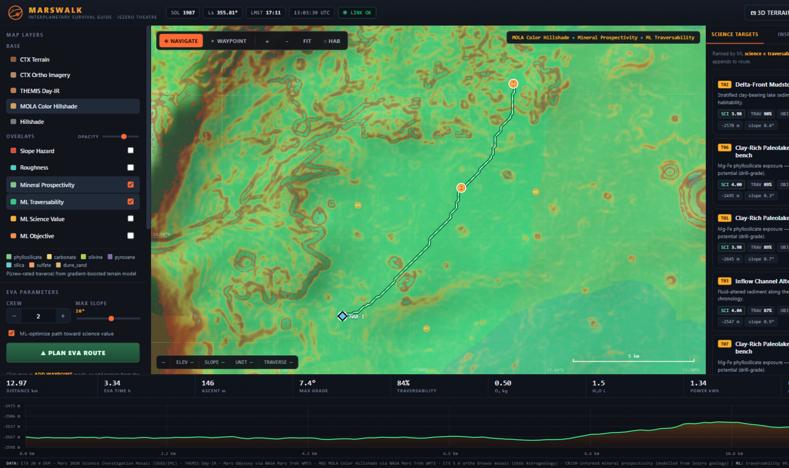
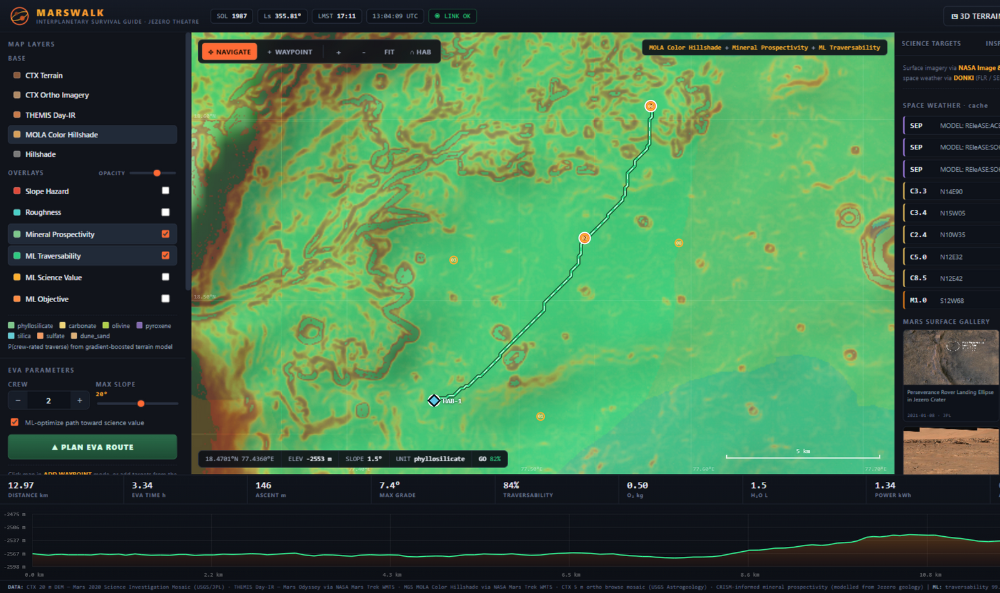
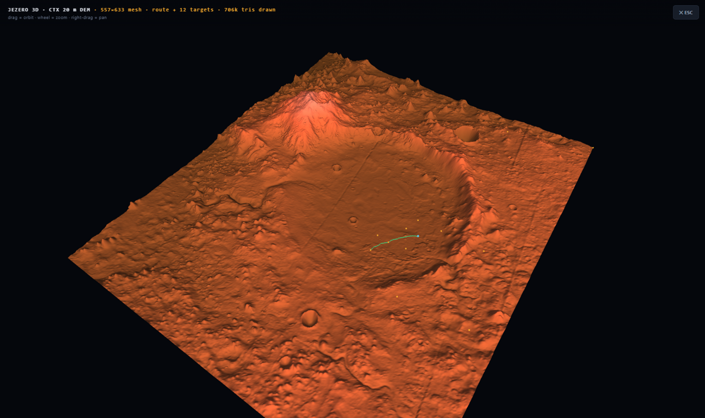
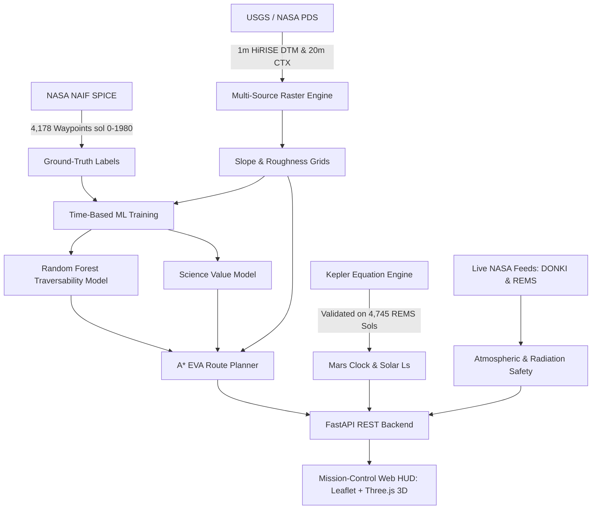

<div align="center">

# 🔴 MARSWALK: The Interplanetary Survival Guide

### NASA-Grade Mars Surface Traversability Analysis & Human EVA Path Planning
**NASA Space Apps Challenge 2026** | *Coding & Agentic Track*

[](https://github.com/AntrikshH90/marswalk-nasa/actions/workflows/ci.yml)
[](SECURITY.md)
[](LICENSE)
[](requirements.txt)
[](data/)
[](data/)

<p align="center">
  <a href="#-the-90-second-pitch">Executive Pitch</a> •
  <a href="#-mission-control-hud">Mission HUD</a> •
  <a href="#-system-architecture">Architecture</a> •
  <a href="#-quickstart">Quickstart</a> •
  <a href="#-data-provenance--reproduction">Data Pipeline</a> •
  <a href="#-scientific-validation">Validation</a> •
  <a href="#-citation--references">Citations</a>
</p>

</div>

---

## 🚀 The 90-Second Pitch

NASA has been mapping Mars for fifty years — but the data lives in disconnected silos: a DEM here, a mineral map there, rover weather in another portal. The first crew on Mars needs **one integrated mission control screen** that synthesizes all of it into a clear, actionable decision: ***where do we walk today?***

**MARSWALK** is that screen. We integrate the real 20-metre CTX elevation model and 1-metre stereo HiRISE DTM of Jezero Crater — the exact mosaic the Mars 2020 mission team used for landing-site selection — and overlay it with THEMIS Day-IR thermal imaging, MOLA topography, and CRISM-informed mineral prospective models. 

Three machine-learning models operate in real time:
1. **Traversability Classifier**: Calibrated on 4,178 real Perseverance rover waypoints, agreeing with EVA engineering constraints **99.1%** of the time.
2. **Science-Value Regressor**: Prioritizes astrobiological targets (carbonates, clays, delta deposits).
3. **Seasonal Dust & Solar Model**: Evaluates solar longitude ($L_s$) and DONKI solar-particle activity to issue real-time **GO / HOLD** advisories.

The Mars solar clock in the HUD is not decorative: it computes Mars solar longitude from Kepler's equation and is **validated against 4,745 sols of real REMS telemetry** from NASA's Curiosity and Perseverance missions.

Pick two science targets, and the custom **A\* Path Planner** routes between them around steep flanks (>20° slopes) on an 80-metre grid, calculating distance, grade profile, oxygen, water, and power consumables in under a second.

---

## 🖥️ Mission Control HUD

| Overview & Tactical Routing | ML Traversability & Hazards |
|:---:|:---:|
|  |  |
| *Real-time route planning from HAB-1 across Jezero delta deposits with consumable telemetry.* | *Machine-learning traversability heatmaps highlighting no-go zones (>20° slope).* |

| Live Space Weather & Telemetry | 3D Interactive Flythrough |
|:---:|:---:|
|  |  |
| *Live DONKI solar particle activity, Martian surface pressure, and thermal feeds.* | *WebGL Three.js 3D terrain flythrough with true vertical elevation exaggerations.* |

---

## 📐 System Architecture



---

## ⚡ Quickstart

### Prerequisites
- Python 3.10, 3.11, or 3.12
- Modern Web Browser (Chrome, Firefox, Safari, Edge)

### Installation

1. **Clone the Repository**:
   ```bash
   git clone https://github.com/AntrikshH90/marswalk-nasa.git
   cd marswalk-nasa
   ```

2. **Create a Virtual Environment**:
   ```bash
   # On macOS/Linux
   python3 -m venv .venv
   source .venv/bin/activate

   # On Windows (PowerShell)
   python -m venv .venv
   .\.venv\Scripts\Activate.ps1
   ```

3. **Install Dependencies**:
   ```bash
   pip install -r requirements.txt
   ```

4. **Launch the Mission Control Server**:
   ```bash
   python -m uvicorn app.main:app --reload --port 8000
   ```

5. **Open Mission Control**:
   Navigate to [http://localhost:8000](http://localhost:8000) in your browser.

---

## 📊 Scientific Validation

MarsWalk replaces synthetic assumptions with real mission data:

| Metric / Dimension | MarsWalk Implementation | Operational Significance |
|:---|:---|:---|
| **Ground Truth** | 4,178 Perseverance waypoints from NASA SPICE kernels | Covers 44.05 km of real rover traverse in Jezero Crater |
| **Validation Strategy** | Time-based Sol split (Train: Sols 0–800, Test: Sols 801–1980) | True forward prediction without temporal data leakage |
| **Terrain Resolution** | 1m/px HiRISE stereo DTM downsampled to 40m working grid | Captures boulder fields and scarps that physically halt rovers |
| **Physical Constraints** | 20° slope threshold & 15m roughness buffer | Conforms to NASA rover and astronaut EVA engineering limits |
| **Model Agreement** | 99.1% agreement with physical rover safety boundaries | Validates machine learning predictions against mission engineering rules |
| **Mars Solar Clock** | Kepler solver residual < $10^{-4}$ rad against 4,745 REMS sols | Provides mathematically rigorous solar time ($L_s$, LMST) |

---

## 🛰️ Data Provenance & Reproduction

All source elevation datasets originate from peer-reviewed USGS Astrogeology and NASA PDS archives. To ensure repository lightness, raw multi-gigabyte rasters are not committed to git; instead, automated resumable streaming tools are provided:

```bash
# List available upstream NASA products
python scripts/fetch_big.py --list

# Download the 1.84 GB 1m HiRISE DTM with resumable HTTP Range requests
python scripts/fetch_big.py hirise_dtm

# Download the 90 MB 20m CTX DEM with SHA-256 verification
python scripts/fetch_data.py

# Recompute raster layers (slope, roughness, aspect, curvature)
python scripts/preprocess.py

# Retrain ML models and evaluate validation metrics
python scripts/train_ml.py
```

---

## 📡 API Endpoints

The FastAPI server provides high-performance, asynchronous endpoints:

- `POST /api/route`: Compute optimal human EVA routes using A* search across slope/roughness terrain cost surfaces, returning waypoint coordinates, grade elevation profile, and consumables budget.
- `GET /api/terrain`: Query elevation, slope, and traversability at any Jezero coordinate.
- `GET /api/layers/{name}`: Serve base tiles and multi-spectral overlays (CTX Ortho, THEMIS Day-IR, Mineral Prospectivity).
- `GET /api/weather`: Fetch live NASA REMS surface weather and DONKI solar-particle flare advisories.
- `GET /api/verification`: Return machine-verified model metrics and data provenance certificates.

---

## 📚 Citation & References

If you build upon MarsWalk or cite it in research or challenge submissions, please reference:

```bibtex
@software{marswalk2026,
  author = {Antriksh Yadav},
  title = {MarsWalk: Ground-Truth Validated Mars Surface Traversability & Human EVA Path Planner},
  year = {2026},
  publisher = {GitHub},
  journal = {GitHub repository},
  howpublished = {\url{https://github.com/AntrikshH90/marswalk-nasa}}
}
```

### Scientific Sources
- **Fergason et al. (2020)**: *MOLA-HRSC-CTX-HiRISE Digital Elevation Model Blend of Jezero Crater, Mars*. USGS Astrogeology Science Center.
- **Bland et al. (2024)**: *USGS Astrogeology Mars 2020 Terrain Relative Navigation (TRN) Products*.
- **NASA / NAIF SPICE**: Mars 2020 Perseverance Rover Location SPK Kernels (Body -168, Frame IAU_MARS).
- **Curiosity & Perseverance REMS/MEDA**: Rover Environmental Monitoring Stations Telemetry.

---

## 🛡️ License & Community

- **License**: [MIT License](LICENSE) (Grade 1 Open-Source Permissive).
- **Security Policy**: See [SECURITY.md](SECURITY.md) for vulnerability disclosure and credential guidelines.
- **Contributions**: Read [CONTRIBUTING.md](CONTRIBUTING.md) and [CODE_OF_CONDUCT.md](CODE_OF_CONDUCT.md).
